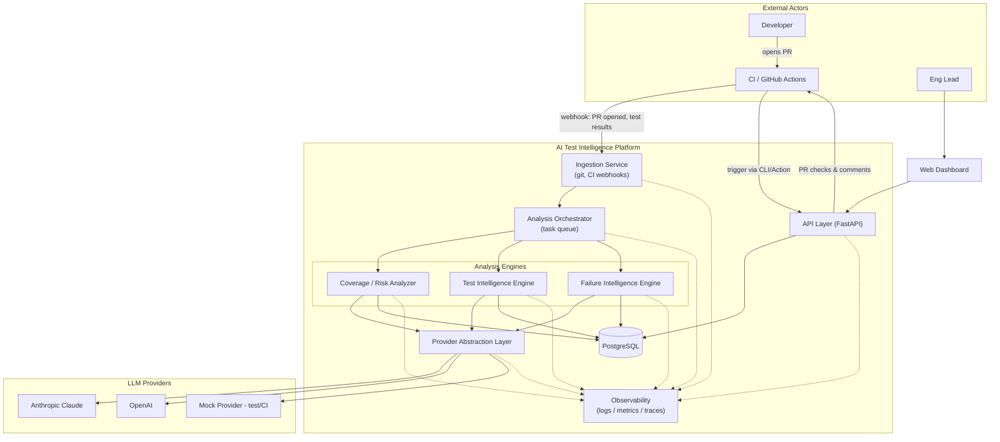
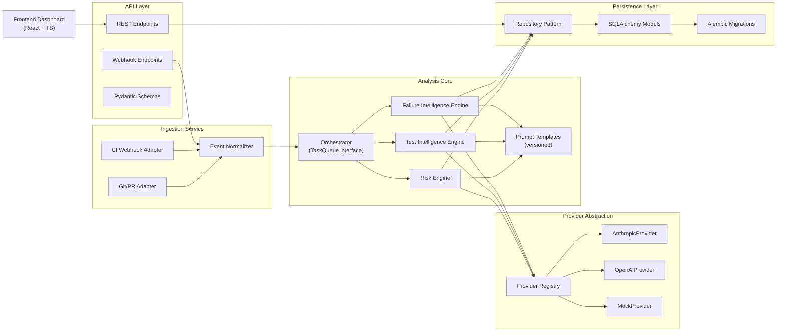
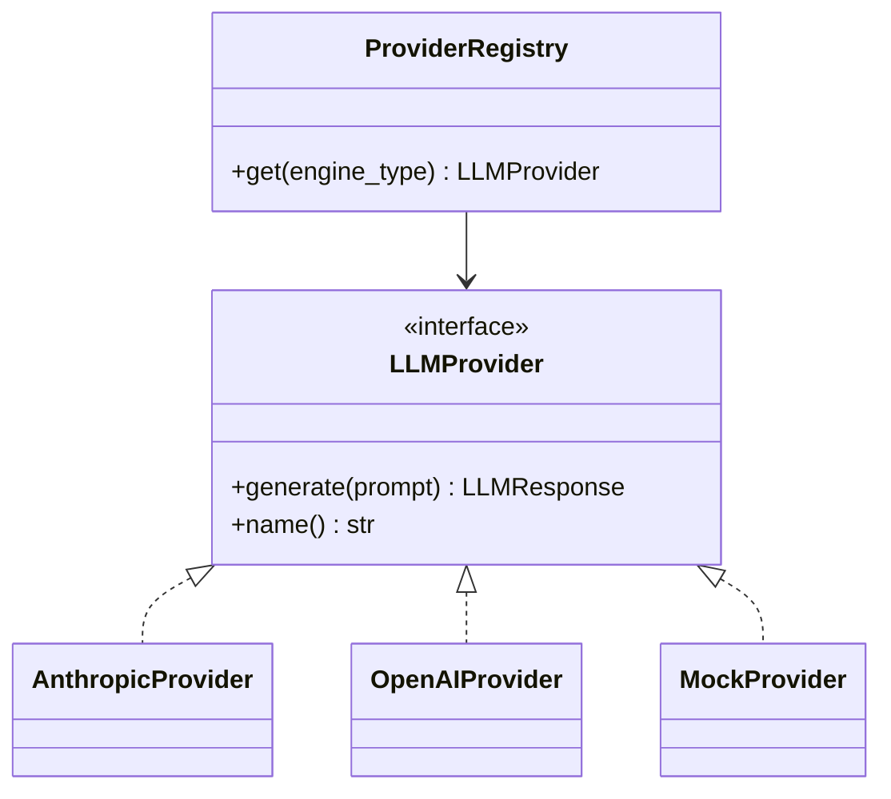

# Architecture

## 1. Product Definition

The AI Test Intelligence Platform ingests a codebase, its test suite, and its CI test-run
history, then applies LLM-backed analysis to answer three questions engineering teams
routinely under-invest in tooling for:

1. **Where is testing risk concentrated?** — coverage/risk scoring of code relative to
   change frequency, complexity, and existing test coverage.
2. **What tests should exist but don't?** — AI-generated test suggestions for
   undertested or high-risk code paths.
3. **Why did this test fail, and does it matter?** — AI-assisted triage of CI failures,
   classifying them as regressions, flaky tests, or environment issues, and clustering
   recurring flaky patterns over time.

These three capabilities share one pipeline: ingestion → orchestration → provider-backed
analysis → persistence → API → dashboard. That shared spine is what makes this a
*platform* rather than three unrelated scripts — a new analysis capability is a new
"engine" plugged into the same orchestration and provider layers, not a new system.

A fourth, cross-cutting concern sits on top of all three: **governance.** AI-generated
findings are advisory by construction, not self-executing — a risk assessment that meets
certain conditions (high release risk, low confidence, authentication/authorization or
breaking-change categories, security-sensitive findings, insufficient evidence) requires
an explicit human decision before it can be treated as an approved signal anywhere
outside the platform's own dashboard. See §12.

**Primary integration point:** GitHub Actions / pull requests. A PR is the natural unit
of "what changed" and the natural place to surface risk findings and test suggestions
before merge. CI webhook ingestion covers the failure-triage capability independently of
PR analysis.

## 2. High-Level Architecture



**Flow summary:**

- A PR event or CI test-run completion arrives via webhook and is normalized by the
  Ingestion Service.
- The Orchestrator enqueues an analysis run (risk, test_intelligence, and/or
  failure_intelligence — the
  ingestion event determines which engines apply) and executes it asynchronously.
- Engines never call an LLM provider directly; they go through the Provider Abstraction
  Layer, which handles provider selection, retries, and usage/cost accounting.
- Results (risk findings, test suggestions, flaky-test findings) are persisted and
  exposed via the API to the dashboard and back to the originating PR as a status check
  / comment.

**Implementation status (Sprint 12):** the PR half of this flow is live for GitHub —
`POST /api/v1/webhooks/github` is the webhook receiver; `integrations/github/` is the
"Provider Abstraction Layer" equivalent for the GitHub side of this diagram (a
`GitHubClient` interface, same pattern as `LLMProvider`), handling both the diff fetch
that feeds analysis and the status-check/PR-comment publish that closes the loop back to
GitHub. CI webhook ingestion (the other half of this diagram's "webhook" arrow) remains
future scope — see system-design.md §4's `/webhooks/ci` entry.

## 3. Component Diagram



Each engine is independent and stateless aside from what it reads/writes through the
repository pattern — adding a fourth engine later requires no change to the
orchestrator, provider layer, or API contracts beyond registering the new engine and its
result schema.

## 4. Repository Layout

```
ai-test-intelligence-platform/
├── README.md
├── docs/
│   ├── architecture.md
│   └── system-design.md
├── backend/
│   ├── app/
│   │   ├── api/                # FastAPI routers, request/response schemas, GitHub webhook endpoint
│   │   ├── ingestion/           # Diff parsing, GitHub PR webhook event normalization
│   │   ├── integrations/
│   │   │   └── github/           # GitHubClient abstraction, HMAC verification, PR comment/status publishing
│   │   ├── governance/            # Policy rules, sensitive-data redaction, review-request/audit-event service
│   │   ├── orchestration/       # TaskQueue interface + in-process implementation
│   │   ├── analysis/
│   │   │   ├── risk/            # Coverage/risk analyzer engine
│   │   │   ├── test_intelligence/ # Test Intelligence Engine
│   │   │   ├── failure_intelligence/ # Failure Intelligence Engine
│   │   │   └── prompts/          # Versioned prompt templates, per engine
│   │   ├── providers/            # LLM provider abstraction + implementations
│   │   ├── persistence/           # SQLAlchemy models, repositories
│   │   └── observability/          # Logging, metrics, LangSmith tracing setup
│   ├── migrations/              # Alembic migrations
│   └── tests/
├── frontend/
│   ├── src/
│   │   ├── pages/            # Route-level views (Repo overview, Risk, Suggestions, Flaky Tests)
│   │   ├── components/        # Shared presentational components
│   │   ├── api-client/         # Typed API client (generated or hand-written)
│   │   └── state/               # Data-fetching/cache state (TanStack Query)
│   └── e2e/                   # Playwright smoke tests
└── .github/
    └── workflows/             # ci.yml, integration.yml, e2e.yml, docker.yml, live-smoke.yml
```

This is a monorepo: backend and frontend evolve together, and a single PR can span both
when a feature requires it, which matters for a project of this size and single-team
ownership model.

## 5. Backend Module Organization

- **`api/`** depends on `persistence/` (via repositories) and `orchestration/` (to
  enqueue analysis runs). It never imports `providers/` or engine internals directly —
  the API's job is HTTP concerns and request validation, not analysis logic.
- **`ingestion/`** depends only on `orchestration/`. It translates external events
  (GitHub webhook payloads, CI callback payloads) into internal domain events and hands
  them to the orchestrator. It has no knowledge of analysis engines.
- **`integrations/github/`** has no dependencies on any other backend module besides
  `observability/` (for logging) — a pure abstraction over the GitHub REST API (diff
  fetch, commit status, PR comments) plus HMAC signature verification, deliberately kept
  isolated the same way `providers/` is. `api/webhooks.py`, not this module, is what
  calls the orchestrator — see its Sprint 12 status note below. **Sprint 13 exception:**
  `integrations/github/publisher.py` also depends on `governance/` and, transitively,
  `persistence/` — see this section's Sprint 13 status note for why that's a deliberate
  addition, not scope creep.
- **`governance/`** depends on `persistence/` (to read/write `ReviewRequest`/
  `AuditEvent`) and nothing else analysis-specific — it operates on the same
  `AnalysisResult.output` dict shape every engine already produces, not on engine
  internals. Both `integrations/github/publisher.py` and `api/risk.py` call into it; it
  never calls back into either.
- **`orchestration/`** depends on `analysis/` engines by interface only (each engine
  implements a common `AnalysisEngine.run(context) -> Result` contract). The
  orchestrator decides *when* and *in what order* engines run; it has no analysis logic
  of its own.
- **`analysis/*`** engines depend on `providers/` (for LLM calls) and `persistence/`
  (to read source context and write findings). Engines do not depend on each other.
- **`providers/`** has no dependencies on any other backend module — it is a pure
  abstraction over external LLM APIs plus the mock implementation, deliberately kept
  isolated so it can be extracted or reused independently.
- **`persistence/`** has no dependencies on other backend modules besides `config.py`.

This layering means a dependency-direction rule holds throughout: `api` and `ingestion`
→ `orchestration` → `analysis engines` → `providers` / `persistence`. Nothing points
backward.

**Implementation status (Sprint 12):** GitHub PR integration is live —
`app/api/webhooks.py` (`POST /api/v1/webhooks/github`) is the entry point; it verifies
the HMAC-SHA256 signature (`integrations/github/signature.py`) against the raw request
body, normalizes the payload (`ingestion/github_webhook.py`), fetches the PR's diff via
`GitHubClient` (`integrations/github/client.py`), and triggers Risk analysis (always)
plus Test Intelligence analysis (when `ingestion/diff.py`'s `diff_touches_non_test_source`
heuristic finds non-test source in the diff) through the same
`AnalysisOrchestrator.submit()` every other trigger source uses. `AnalysisOrchestrator`
gained an optional `on_result` completion-hook parameter this sprint (generic, not
GitHub-specific) so a caller can react once a run reaches a terminal state without
polling; `integrations/github/publisher.py`'s `PRAnalysisPublisher` uses it to join the
Risk and Test Intelligence completions (which run on independent background threads,
completing in no guaranteed order) into one commit status + one PR comment. PR comments
deliberately never include full model output — no `RiskFinding.rationale`, no
`TestSuggestion.suggested_test_code` — only scores, category labels, a capped findings
list, and a link back to the platform dashboard (`integrations/github/comment.py`).
`GITHUB_API_TOKEN` unset falls back to a `NullGitHubClient` (webhooks still process and
trigger analysis, just without publishing back to GitHub), same "no key, no provider"
rule as `ProviderRegistry`. The Statuses API is used for the check result rather than
the Checks API, since Checks requires a GitHub App installation (a different auth model)
where Statuses works with a plain token — see `RestGitHubClient`'s docstring for the
full rationale; a GitHub App integration remains a natural later increment if richer
Checks UI is ever needed.

**Implementation status (Sprint 13):** governance and human review is live — see §12 for
the full design. In one sentence: `governance/policy.py` evaluates every completed risk
result against a fixed set of rules (thresholds configurable via
`GovernancePolicySettings`/`GOVERNANCE_*` env vars); a triggered rule creates a
`ReviewRequest` + an immutable `AuditEvent` (`governance/review_service.py`) instead of
letting `integrations/github/publisher.py` publish an automatic success/failure commit
status, and only `api/review.py`'s approve/reject endpoints — acting on a persisted human
decision — can publish that final status afterward. `AnalysisOrchestrator.submit()` also
gained a redaction pass over `inputs` this sprint (`governance/redaction.py`), applied
before any engine (not just risk) ever sees the content, independent of governance's
review-gating logic.

## 6. Frontend Organization

- **`pages/`** — one page per top-level dashboard view: repository overview, risk
  findings, test suggestions, flaky test history, and (Sprint 13) the review queue
  (`ReviewQueuePage`) at `/review-queue`, listing every `ReviewRequest` with
  `status=pending` across all repositories with inline approve/reject. Pages compose
  components and own data fetching via `state/`.
- **`components/`** — presentational, no direct API calls. Receive data and callbacks as
  props.
- **`api-client/`** — the only module that knows the API's URL shape and payload
  contracts. Typed against the backend's Pydantic schemas so a backend contract change
  surfaces as a frontend type error, not a runtime failure.
- **`state/`** — TanStack Query hooks per resource (`useRiskFindings`,
  `useTestSuggestions`, etc.), giving pages caching/loading/error states for free
  without each page reimplementing fetch logic.

**Implementation status (Sprint 10):** built as designed above. Six pages — Repository
Overview, Risk Analysis, Test Suggestions, Failure Intelligence, Analysis Run History,
and Human Review (a cross-repo pending-suggestion queue, since there's no dedicated
backend aggregation endpoint for it yet — built client-side over the per-repo endpoint,
documented as a scaling note in `state/usePendingReview.ts`). Trigger-and-poll flows use
`AnalysisRun.status` polling (`state/useAnalysisRuns.ts`'s `usePollAnalysisRunStatus`)
rather than a websocket/SSE push, consistent with system-design.md §4's "clients poll for
completion" API contract. Two small backend additions were needed to power views the API
didn't yet expose: `GET /api/v1/repositories` (list) and
`GET /api/v1/repositories/{id}/analysis-runs[/{run_id}/llm-invocations]` (run history +
the provider/model/latency/token-usage detail `LLMInvocation` has captured since Sprint
9) — both thin routes over repository methods that already existed. CORS is wide open
(`allow_origins=["*"]`) since there's still no auth model to scope it against.

## 7. Provider Abstraction Strategy



- A single `LLMProvider` interface: `generate(prompt: PromptSpec) -> LLMResponse`,
  where `LLMResponse` includes the raw text/structured output, token usage, latency, and
  provider/model identifiers.
- Concrete providers: `AnthropicProvider` (primary), `OpenAIProvider` (secondary,
  demonstrates the abstraction isn't a single-vendor shim), `MockProvider`
  (deterministic, used in all unit/integration tests and CI — no real API key ever
  required to run the test suite).
- `ProviderRegistry` resolves a provider per analysis engine from configuration, so
  e.g. failure_intelligence can run on a cheaper/faster model while test_intelligence uses a stronger one,
  without code changes.
- Prompt templates live in `analysis/prompts/`, are version-tagged, and are treated as
  reviewable artifacts (a prompt change is a diff like any other code change).
- Every provider call is wrapped with retry/backoff and timeout handling at the registry
  boundary, not duplicated per engine.

**Implementation status (Sprint 2):** `LLMProvider`, `PromptSpec`, `LLMResponse`,
`MockProvider`, and `ProviderRegistry` are implemented in `backend/app/providers/`.
Two scoping decisions worth recording:

- The registry currently resolves *provider selection* per engine
  (`risk_provider` / `test_intelligence_provider` / `failure_intelligence_provider` config
  overrides), not per-engine *model* selection. With only `MockProvider` registered, a model
  override has no observable effect — that configuration surface is deferred until a second
  real provider (Sprint 3) makes the failure-intelligence-cheap/test-intelligence-strong
  distinction meaningful,
  rather than building it against a provider that can't exercise it.
- Retry/backoff/timeout wrapping is not yet implemented — `MockProvider` never makes a
  network call, so there's nothing to retry against. This lands with the first real
  provider integration in Sprint 3.

`AnthropicProvider` and `OpenAIProvider` remain unimplemented, per Sprint 2 scope.

## 8. Observability Strategy

- **Structured logging**: JSON logs carrying `repo_id`, `analysis_run_id`, and a
  correlation ID threaded from ingestion through to persistence, so one run's full
  lifecycle is greppable by a single ID.
- **Metrics**: request latency, analysis run duration, queue depth, and — specific to
  this platform — LLM token usage and cost broken down by provider/model/engine type.
  Exposed via a Prometheus-compatible `/metrics` endpoint; not tied to a specific
  metrics backend.
- **Tracing**: OpenTelemetry spans across ingestion → orchestration → provider call →
  persistence, exportable via OTLP to any compatible backend — no vendor lock-in
  assumed at this stage.
- **LLM audit trail**: every prompt/response pair persisted (with sensitive content
  redaction rules) keyed to `analysis_run_id`, enabling after-the-fact debugging of why
  an engine produced a given finding — essential for an AI system where "why did it say
  that" is a routine support question, not an edge case.

**Implementation status (Sprint 9):**

- **Structured JSON logging**, **correlation IDs**, **`analysis_run_id`**, and **trace
  IDs** are implemented (`backend/app/observability/logging.py`, threaded through
  `AnalysisContext`/`JobStatus` since Sprint 5) and now also appear on every
  `llm_invocation_recorded` log line emitted by `observability/llm_tracking.py`.
- **`/metrics`** (`backend/app/api/metrics.py`) is a Prometheus-compatible endpoint
  (`prometheus_client`, no metrics backend lock-in) exposing `llm_invocations_total`,
  `llm_tokens_total` (labeled `provider`/`model`/`engine_type`/`direction`),
  `llm_latency_seconds`, `llm_estimated_cost_usd_total`, and `analysis_runs_total`
  (labeled `engine_type`/`status`). Estimated cost comes from a small static per-model
  price table (`observability/pricing.py`) — approximate, not a billing reconciliation;
  an unrecognized model reports no cost rather than a fabricated one.
- **LLM audit trail**: `LLMInvocation` rows (persisted since this sprint —
  `observability/llm_tracking.py`'s `observed_generate()` wraps every
  `LLMProvider.generate()` call site in the three engines) carry token usage, latency,
  and estimated cost keyed to `analysis_run_id`, as designed above. Prompt/response
  *content* is deliberately not persisted here (a decision already made in Sprint 4,
  not a gap introduced this sprint) — token counts and metadata only.
- **LangSmith** (`observability/langsmith_client.py`, `llm_tracking.py`,
  `eval_datasets.py`, `experiments.py`) is the trace-capture/experiment-tracking layer:
  every LLM call becomes a LangSmith run tagged with prompt version
  (`analysis/*/prompts.py`'s `PROMPT_VERSION` constants), provider/model, and
  correlation/trace IDs; three small representative-scenario datasets (risk analysis,
  test intelligence, failure intelligence) sync on startup; `run_evaluation_experiment()`
  replays a dataset through a real engine for lightweight experiment tracking.
  **Strictly optional** — `LANGSMITH_ENABLED=false` is the default, every LangSmith call
  is wrapped so a failure (missing key, unreachable, disabled) never fails the request
  it's attached to, and normal CI runs with it disabled and no credentials.
- **OpenTelemetry tracing** across ingestion → orchestration → provider call →
  persistence remains deferred — not implemented. **Sensitive-content redaction** is no
  longer deferred: `governance/redaction.py` (Sprint 13) redacts secret material from
  every analysis run's `inputs` before an engine ever sees it, and from every
  `AuditEvent.payload` before it's persisted — see §12.

## 9. Testing Strategy

- **Backend unit tests** (pytest): each module tested in isolation; analysis engines
  tested exclusively against `MockProvider` so test runs are deterministic and free.
- **Backend integration tests**: exercise ingestion → orchestration → persistence
  end-to-end against a real (dockerized/testcontainers) PostgreSQL instance, still using
  `MockProvider` for LLM calls.
- **Provider contract tests**: a shared test suite run against every `LLMProvider`
  implementation (including real ones) to guarantee interface compliance; the real
  provider variants are gated behind a manual/opt-in CI job so normal PRs never spend
  API budget or become flaky due to live network calls.
- **API contract tests**: request/response shape validation per endpoint.
- **Frontend**: component tests (Vitest + React Testing Library) once frontend code
  exists; end-to-end (Playwright) deferred until there's a UI worth covering.
- **GitHub webhook tests (Sprint 12)**: `tests/api/test_webhooks.py` drives the full
  webhook -> signature verification -> orchestration -> engine -> publish flow through
  FastAPI's TestClient, with a `FakeGitHubClient` (implementing the `GitHubClient`
  interface) standing in for the real GitHub API — no live repository or network access
  required, same "fake the boundary interface" pattern `MockProvider` uses for LLM
  calls. `tests/integrations/github/` covers signature verification, comment/status
  text building (including an explicit assertion that no full model output — raw
  rationale text, generated test source — ever appears in what gets built), the REST
  client against an `httpx.MockTransport`, and `PRAnalysisPublisher`'s completion-
  coordination logic (both orderings of risk/test-intelligence completion, failure
  paths, duplicate-callback safety) directly, without going through HTTP.
- **Governance tests (Sprint 13)**: `tests/governance/` covers `policy.py` (every rule,
  each threshold's boundary, the `insufficient_evidence` conditional logic, the global
  kill-switch) and `redaction.py` (each secret pattern, plus an explicit "security
  keywords survive redaction" check) as pure-function unit tests with no I/O;
  `test_review_service.py` covers `ReviewRequest`/`AuditEvent` creation, the decision
  workflow, and the "cannot decide twice" invariant against a real in-memory SQLite
  session. `tests/api/test_webhooks.py` and `test_review_queue.py` cover the two
  trigger paths end-to-end (webhook and manual), including the full
  webhook → pending → approve/reject → GitHub-publish loop.

## 10. CI/CD Strategy

- **`ci.yml`**: Ruff lint, Ruff format check, mypy, and PyTest with coverage for the
  backend; oxlint, Vitest, and a production build for the frontend. Runs on every push
  and PR; required for merge.
- **`integration.yml`**: spins up a PostgreSQL 16 service container, runs Alembic
  migrations (upgrade to head, then a downgrade/upgrade round trip), and runs the
  PostgreSQL integration suite against it. Required for merge.
- **`e2e.yml`**: installs Playwright + Chromium and runs `frontend/e2e/` against a real
  backend (MockProvider, disposable SQLite) and a real Vite dev server, both started by
  Playwright itself. Required for merge.
- **`docker.yml`**: builds the backend and frontend Docker images independently, then
  validates `docker-compose.yml` (`docker compose config` + `docker compose build`).
  Build-only — nothing is pushed to a registry yet; that remains deferred until the
  platform has an actual deployment target (§11).
- **`live-smoke.yml`**: manually triggered only (`workflow_dispatch`), runs the Anthropic
  provider contract tests against the real API using an `ANTHROPIC_API_KEY` repository
  secret. Never runs automatically, to keep normal CI free of external API cost and
  flakiness — the only workflow in the repo permitted to spend real API budget.
- Branch protection on `main` requires `ci.yml`, `integration.yml`, `e2e.yml`, and
  `docker.yml` to pass.

## 11. Deliberately Deferred

To keep this document honest about scope, the following are acknowledged as future
decisions, not oversights: authentication/authorization model, multi-tenancy,
deployment target (container platform vs. serverless), a distributed task queue
(Celery/Temporal) to replace the in-process orchestrator once real concurrency demands
it, CI webhook ingestion (the failure-intelligence-triggering half of the ingestion
diagram in §2 — GitHub PR ingestion landed in Sprint 12, CI ingestion has not), a
GitHub App integration (§5's Sprint 12 status note explains why the Statuses API was
used instead for now), and **per-repository** governance policy configuration —
`GovernancePolicySettings` (§12) is process-wide, not scoped to a repository, so every
registered repository shares the same risk-score/confidence thresholds and rule
toggles today. (Sprint 12's original note here — "a per-repository configurable
risk-gating policy... hardcodes 'only `block` fails the check'" — is superseded by
Sprint 13: the gating conditions are now genuinely configurable, just not per-repo yet.)

## 12. Governance and Human Review

Sprint 13's requirement in one sentence: AI output must never silently become an
approved operational engineering action. Concretely, in this platform, the only
externally-visible "approved" signal that exists is a GitHub commit status turning
green — there's no auto-merge, no deployment trigger, nothing else to gate. So the
mechanism is specific: **the commit status can only resolve to `success` or `failure`
two ways** — an ungated risk result publishing automatically (Sprint 12's original
behavior, still true for the common case), or a human's explicit approve/reject decision
publishing it afterward. There is no third path.

**Policy evaluation (`governance/policy.py`).** A pure function,
`evaluate_risk_policy(risk_output) -> list[PolicyReason]`, run against every completed
Risk Engine result — `AnalysisResult.output`, the same dict `integrations/github/comment.py`
already reads, not a new data shape. Six independent rules, each producing its own
reason when triggered (a single result can trigger several at once):

| Rule | Condition |
|---|---|
| `high_release_risk` | `release_recommendation == "block"`, or `risk_score` at or above a configurable threshold |
| `elevated_release_risk` | `release_recommendation == "caution"` — off by default (see below) |
| `low_confidence` | `confidence_score` below a configurable threshold |
| `authentication_or_authorization_change` | categories include `authentication_authorization` |
| `security_sensitive_finding` | categories include `security_sensitive_file` |
| `breaking_api_or_schema_change` | categories include `api_contract` or `schema_database` |
| `insufficient_evidence` | fewer than N evidence items recorded, **but only when the result also asserts elevated risk** (non-`proceed` recommendation or a high score) — a clean, low-risk "nothing found" result legitimately has nothing to cite evidence for; this rule exists to catch the opposite case, an unsupported risk claim, not to flag every quiet result |

The category rules map directly onto `analysis/risk/heuristics.py`'s actual
`RISK_CATEGORIES` vocabulary — not an independently invented taxonomy that could drift
out of sync with what the engine produces. Thresholds and per-rule on/off toggles are
configurable via `GovernancePolicySettings` (`GOVERNANCE_*` env vars,
`governance/config.py`); the category mapping itself is a fixed module constant (see
that settings class's docstring for why). `GOVERNANCE_ENABLED=false` is a global
kill-switch — every result auto-approves, same as pre-Sprint-13 behavior — present for
environments (local dev, CI) where the review workflow would just add friction.

**Review queue (`ReviewRequest`, `persistence/models.py`).** Created only when at least
one rule triggers. Mutable current-state: `status` (`pending` → `approved`/`rejected`),
`reviewer`, `review_reason`, `decided_at` are updated in place by a decision — this
table always answers "what's true right now", not "what happened". `github_owner`/
`github_repo`/`github_head_sha`/`github_pr_number` are populated only when the
triggering run came from a GitHub webhook (`integrations/github/publisher.py`); a
manually-triggered run (`api/risk.py`) that trips policy still gets a `ReviewRequest` —
visible in the dashboard — just with nothing to publish a decision back to.

**Audit trail (`AuditEvent`, same module).** Append-only by *repository API design*, not
a database trigger: `AuditEventRepository` (`persistence/repositories.py`) is
deliberately not a `BaseRepository` subclass, and exposes only `record()` (insert) and
`list_*()` (read) — there is no update or delete method to call in the first place.
Every `AuditEvent.payload` is redacted before construction. Three event types today:
`policy_evaluated` (written for *every* completed risk result, triggered or not — proof
the gate actually ran, not just a record of when it fired), `review_required`, and
`review_approved`/`review_rejected` (reviewer identity, reason, and timestamp — the
concrete "reviewer identity / review reason / timestamp / immutable audit event"
requirement).

**Redaction (`governance/redaction.py`).** Pattern-based over secret *values* — AWS
access/secret keys, GitHub/Slack tokens, PEM private-key blocks, bearer tokens, and
generic `password`/`secret`/`token`/`api_key` assignments — never over the security
*keywords* `analysis/risk/heuristics.py` and `analysis/test_intelligence/heuristics.py`
match on to detect risk signals in the first place; blanking out the word "password"
would silently defeat the platform's own risk detection, so redaction only ever removes
things that look like actual secret material, leaving identifiers and surrounding code
structure untouched. Two call sites: `AnalysisOrchestrator.submit()` redacts every
string in `inputs` before `AnalysisContext` is built — before any engine can embed it
into an LLM prompt — and `governance/review_service.py` redacts every `AuditEvent.payload`
before insert, independently (an audit event can be constructed from data that never
went through `submit()`, e.g. a reviewer's free-text `review_reason`).

**The publish-gating mechanism (`integrations/github/publisher.py`).** When a risk
result arrives, `PRAnalysisPublisher` evaluates governance *before* deciding what to
publish. No rule triggered: unchanged Sprint 12 behavior, publish success/failure
immediately. A rule triggers: publish a `pending` status (never success or failure) plus
a short "human review required" comment naming the triggered rules and linking to
`/review-queue/{id}` — and stop. The ordinary findings comment (risk summary +
recommended tests) is *not* posted in this case; the review-required comment replaces
it, not precedes it, so a reviewer sees one comment, not two. If governance itself fails
to persist (a database error mid-write), the result is treated the same as a failed risk
run — an `error` status, never a silent success — because a governance write failure
must not be indistinguishable from "nothing to review."

**Closing the loop (`api/review.py`).** `POST /api/v1/review-queue/{id}/approve` and
`/reject` are the only other code path that can publish a final success/failure commit
status, and only as the direct, synchronous result of `governance/review_service.py`'s
`decide_review()` having already durably recorded the decision — GitHub is a downstream
notification of that decision, not the source of truth for it. A review request can be
decided exactly once (`ReviewAlreadyDecidedError` on a second attempt) — a decision, once
made, is final, the same principle the audit trail's immutability is built on.

