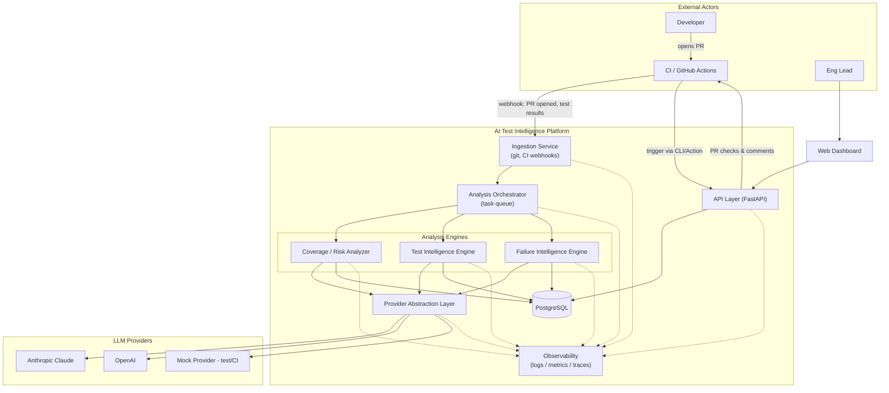
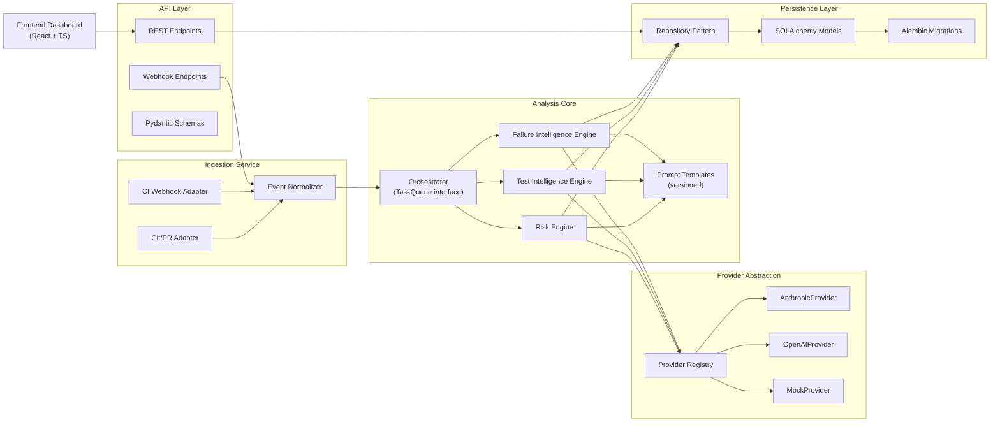
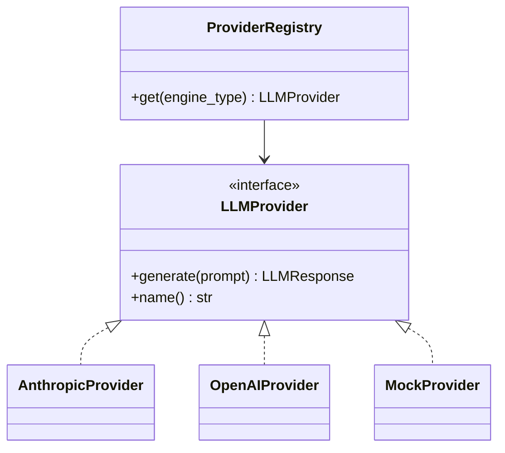

# Architecture

## 1. Product Definition

The AI Test Intelligence Platform ingests a codebase, its test suite, and its CI test-run
history, then applies LLM-backed analysis to answer three questions engineering teams
routinely under-invest in tooling for:

1. **Where is testing risk concentrated?** — coverage/risk scoring of code relative to
   change frequency, complexity, and existing test coverage.
2. **What tests should exist but don't?** — AI-generated test suggestions for
   undertested or high-risk code paths.
3. **Why did this test fail, and does it matter?** — AI-assisted triage of CI failures,
   classifying them as regressions, flaky tests, or environment issues, and clustering
   recurring flaky patterns over time.

These three capabilities share one pipeline: ingestion → orchestration → provider-backed
analysis → persistence → API → dashboard. That shared spine is what makes this a
*platform* rather than three unrelated scripts — a new analysis capability is a new
"engine" plugged into the same orchestration and provider layers, not a new system.

**Primary integration point:** GitHub Actions / pull requests. A PR is the natural unit
of "what changed" and the natural place to surface risk findings and test suggestions
before merge. CI webhook ingestion covers the failure-triage capability independently of
PR analysis.

## 2. High-Level Architecture



**Flow summary:**

- A PR event or CI test-run completion arrives via webhook and is normalized by the
  Ingestion Service.
- The Orchestrator enqueues an analysis run (risk, test_intelligence, and/or
  failure_intelligence — the
  ingestion event determines which engines apply) and executes it asynchronously.
- Engines never call an LLM provider directly; they go through the Provider Abstraction
  Layer, which handles provider selection, retries, and usage/cost accounting.
- Results (risk findings, test suggestions, flaky-test findings) are persisted and
  exposed via the API to the dashboard and back to the originating PR as a status check
  / comment.

## 3. Component Diagram



Each engine is independent and stateless aside from what it reads/writes through the
repository pattern — adding a fourth engine later requires no change to the
orchestrator, provider layer, or API contracts beyond registering the new engine and its
result schema.

## 4. Repository Layout

```
ai-test-intelligence-platform/
├── README.md
├── docs/
│   ├── architecture.md
│   ├── system-design.md
│   └── development-roadmap.md
├── backend/
│   ├── api/                # FastAPI routers, request/response schemas
│   ├── ingestion/           # Git/PR + CI webhook adapters, event normalization
│   ├── orchestration/       # TaskQueue interface + in-process implementation
│   ├── analysis/
│   │   ├── risk/            # Coverage/risk analyzer engine
│   │   ├── test_intelligence/ # Test Intelligence Engine
│   │   ├── failure_intelligence/ # Failure Intelligence Engine
│   │   └── prompts/          # Versioned prompt templates, shared across engines
│   ├── providers/            # LLM provider abstraction + implementations
│   ├── persistence/           # SQLAlchemy models, repositories, Alembic migrations
│   ├── observability/          # Logging, metrics, tracing setup
│   ├── config.py
│   └── tests/
│       ├── unit/
│       └── integration/
├── frontend/
│   ├── src/
│   │   ├── pages/            # Route-level views (Repo overview, Risk, Suggestions, Flaky Tests)
│   │   ├── components/        # Shared presentational components
│   │   ├── api-client/         # Typed API client (generated or hand-written)
│   │   └── state/               # Data-fetching/cache state (TanStack Query)
│   └── tests/
├── infra/
│   ├── docker/               # Dockerfiles, docker-compose for local dev
│   └── ci/                    # Reusable CI workflow fragments
├── scripts/                   # One-off operational/dev scripts
└── .github/
    └── workflows/             # ci.yml, integration.yml, etc.
```

This is a monorepo: backend and frontend evolve together, and a single PR can span both
when a feature requires it, which matters for a project of this size and single-team
ownership model.

## 5. Backend Module Organization

- **`api/`** depends on `persistence/` (via repositories) and `orchestration/` (to
  enqueue analysis runs). It never imports `providers/` or engine internals directly —
  the API's job is HTTP concerns and request validation, not analysis logic.
- **`ingestion/`** depends only on `orchestration/`. It translates external events
  (GitHub webhook payloads, CI callback payloads) into internal domain events and hands
  them to the orchestrator. It has no knowledge of analysis engines.
- **`orchestration/`** depends on `analysis/` engines by interface only (each engine
  implements a common `AnalysisEngine.run(context) -> Result` contract). The
  orchestrator decides *when* and *in what order* engines run; it has no analysis logic
  of its own.
- **`analysis/*`** engines depend on `providers/` (for LLM calls) and `persistence/`
  (to read source context and write findings). Engines do not depend on each other.
- **`providers/`** has no dependencies on any other backend module — it is a pure
  abstraction over external LLM APIs plus the mock implementation, deliberately kept
  isolated so it can be extracted or reused independently.
- **`persistence/`** has no dependencies on other backend modules besides `config.py`.

This layering means a dependency-direction rule holds throughout: `api` and `ingestion`
→ `orchestration` → `analysis engines` → `providers` / `persistence`. Nothing points
backward.

## 6. Frontend Organization

- **`pages/`** — one page per top-level dashboard view: repository overview, risk
  findings, test suggestions, flaky test history. Pages compose components and own data
  fetching via `state/`.
- **`components/`** — presentational, no direct API calls. Receive data and callbacks as
  props.
- **`api-client/`** — the only module that knows the API's URL shape and payload
  contracts. Typed against the backend's Pydantic schemas so a backend contract change
  surfaces as a frontend type error, not a runtime failure.
- **`state/`** — TanStack Query hooks per resource (`useRiskFindings`,
  `useTestSuggestions`, etc.), giving pages caching/loading/error states for free
  without each page reimplementing fetch logic.

Frontend scope is deliberately deferred past Sprint 0 — this section defines the shape
it will take when built, not an implementation commitment yet.

## 7. Provider Abstraction Strategy



- A single `LLMProvider` interface: `generate(prompt: PromptSpec) -> LLMResponse`,
  where `LLMResponse` includes the raw text/structured output, token usage, latency, and
  provider/model identifiers.
- Concrete providers: `AnthropicProvider` (primary), `OpenAIProvider` (secondary,
  demonstrates the abstraction isn't a single-vendor shim), `MockProvider`
  (deterministic, used in all unit/integration tests and CI — no real API key ever
  required to run the test suite).
- `ProviderRegistry` resolves a provider per analysis engine from configuration, so
  e.g. failure_intelligence can run on a cheaper/faster model while test_intelligence uses a stronger one,
  without code changes.
- Prompt templates live in `analysis/prompts/`, are version-tagged, and are treated as
  reviewable artifacts (a prompt change is a diff like any other code change).
- Every provider call is wrapped with retry/backoff and timeout handling at the registry
  boundary, not duplicated per engine.

**Implementation status (Sprint 2):** `LLMProvider`, `PromptSpec`, `LLMResponse`,
`MockProvider`, and `ProviderRegistry` are implemented in `backend/app/providers/`.
Two scoping decisions worth recording:

- The registry currently resolves *provider selection* per engine
  (`risk_provider` / `test_intelligence_provider` / `failure_intelligence_provider` config
  overrides), not per-engine *model* selection. With only `MockProvider` registered, a model
  override has no observable effect — that configuration surface is deferred until a second
  real provider (Sprint 3) makes the failure-intelligence-cheap/test-intelligence-strong
  distinction meaningful,
  rather than building it against a provider that can't exercise it.
- Retry/backoff/timeout wrapping is not yet implemented — `MockProvider` never makes a
  network call, so there's nothing to retry against. This lands with the first real
  provider integration in Sprint 3.

`AnthropicProvider` and `OpenAIProvider` remain unimplemented, per Sprint 2 scope.

## 8. Observability Strategy

- **Structured logging**: JSON logs carrying `repo_id`, `analysis_run_id`, and a
  correlation ID threaded from ingestion through to persistence, so one run's full
  lifecycle is greppable by a single ID.
- **Metrics**: request latency, analysis run duration, queue depth, and — specific to
  this platform — LLM token usage and cost broken down by provider/model/engine type.
  Exposed via a Prometheus-compatible `/metrics` endpoint; not tied to a specific
  metrics backend.
- **Tracing**: OpenTelemetry spans across ingestion → orchestration → provider call →
  persistence, exportable via OTLP to any compatible backend — no vendor lock-in
  assumed at this stage.
- **LLM audit trail**: every prompt/response pair persisted (with sensitive content
  redaction rules) keyed to `analysis_run_id`, enabling after-the-fact debugging of why
  an engine produced a given finding — essential for an AI system where "why did it say
  that" is a routine support question, not an edge case.

**Implementation status (Sprint 9):**

- **Structured JSON logging**, **correlation IDs**, **`analysis_run_id`**, and **trace
  IDs** are implemented (`backend/app/observability/logging.py`, threaded through
  `AnalysisContext`/`JobStatus` since Sprint 5) and now also appear on every
  `llm_invocation_recorded` log line emitted by `observability/llm_tracking.py`.
- **`/metrics`** (`backend/app/api/metrics.py`) is a Prometheus-compatible endpoint
  (`prometheus_client`, no metrics backend lock-in) exposing `llm_invocations_total`,
  `llm_tokens_total` (labeled `provider`/`model`/`engine_type`/`direction`),
  `llm_latency_seconds`, `llm_estimated_cost_usd_total`, and `analysis_runs_total`
  (labeled `engine_type`/`status`). Estimated cost comes from a small static per-model
  price table (`observability/pricing.py`) — approximate, not a billing reconciliation;
  an unrecognized model reports no cost rather than a fabricated one.
- **LLM audit trail**: `LLMInvocation` rows (persisted since this sprint —
  `observability/llm_tracking.py`'s `observed_generate()` wraps every
  `LLMProvider.generate()` call site in the three engines) carry token usage, latency,
  and estimated cost keyed to `analysis_run_id`, as designed above. Prompt/response
  *content* is deliberately not persisted here (a decision already made in Sprint 4,
  not a gap introduced this sprint) — token counts and metadata only.
- **LangSmith** (`observability/langsmith_client.py`, `llm_tracking.py`,
  `eval_datasets.py`, `experiments.py`) is the trace-capture/experiment-tracking layer:
  every LLM call becomes a LangSmith run tagged with prompt version
  (`analysis/*/prompts.py`'s `PROMPT_VERSION` constants), provider/model, and
  correlation/trace IDs; three small representative-scenario datasets (risk analysis,
  test intelligence, failure intelligence) sync on startup; `run_evaluation_experiment()`
  replays a dataset through a real engine for lightweight experiment tracking.
  **Strictly optional** — `LANGSMITH_ENABLED=false` is the default, every LangSmith call
  is wrapped so a failure (missing key, unreachable, disabled) never fails the request
  it's attached to, and normal CI runs with it disabled and no credentials.
- **OpenTelemetry tracing** across ingestion → orchestration → provider call →
  persistence, and **automated sensitive-content redaction rules**, remain deferred —
  not implemented this sprint.

## 9. Testing Strategy

- **Backend unit tests** (pytest): each module tested in isolation; analysis engines
  tested exclusively against `MockProvider` so test runs are deterministic and free.
- **Backend integration tests**: exercise ingestion → orchestration → persistence
  end-to-end against a real (dockerized/testcontainers) PostgreSQL instance, still using
  `MockProvider` for LLM calls.
- **Provider contract tests**: a shared test suite run against every `LLMProvider`
  implementation (including real ones) to guarantee interface compliance; the real
  provider variants are gated behind a manual/opt-in CI job so normal PRs never spend
  API budget or become flaky due to live network calls.
- **API contract tests**: request/response shape validation per endpoint.
- **Frontend**: component tests (Vitest + React Testing Library) once frontend code
  exists; end-to-end (Playwright) deferred until there's a UI worth covering.

## 10. CI/CD Strategy

- **`ci.yml`**: lint, type-check, and unit tests for backend and frontend, on every push
  and PR. This is the required check for merge.
- **`integration.yml`**: spins up a PostgreSQL service container and runs backend
  integration tests. Required for merge once backend code exists.
- **Live provider smoke test workflow**: manually triggered only (`workflow_dispatch`),
  runs the provider contract tests against real Anthropic/OpenAI APIs. Never runs
  automatically, to keep normal CI free of external API cost and flakiness.
- **Docker image build/publish**: deferred to the sprint that introduces deployable
  artifacts — not needed while the platform runs locally/in CI only.
- Branch protection on `main` requires `ci.yml` (and `integration.yml`, once it exists)
  to pass.

## 11. Deliberately Deferred

To keep this document honest about scope, the following are acknowledged as future
decisions, not oversights: authentication/authorization model, multi-tenancy,
deployment target (container platform vs. serverless), and a distributed task queue
(Celery/Temporal) to replace the in-process orchestrator once real concurrency demands
it. See [development-roadmap.md](development-roadmap.md) for sequencing.
