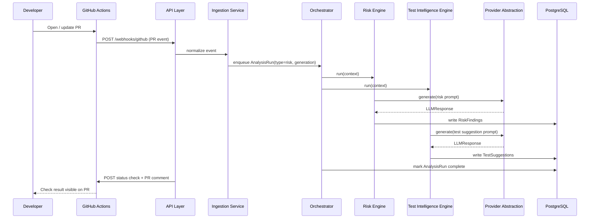
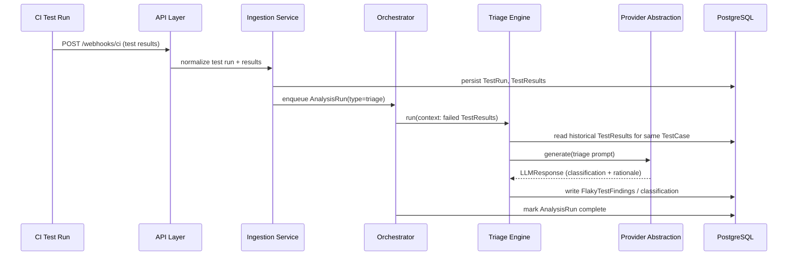
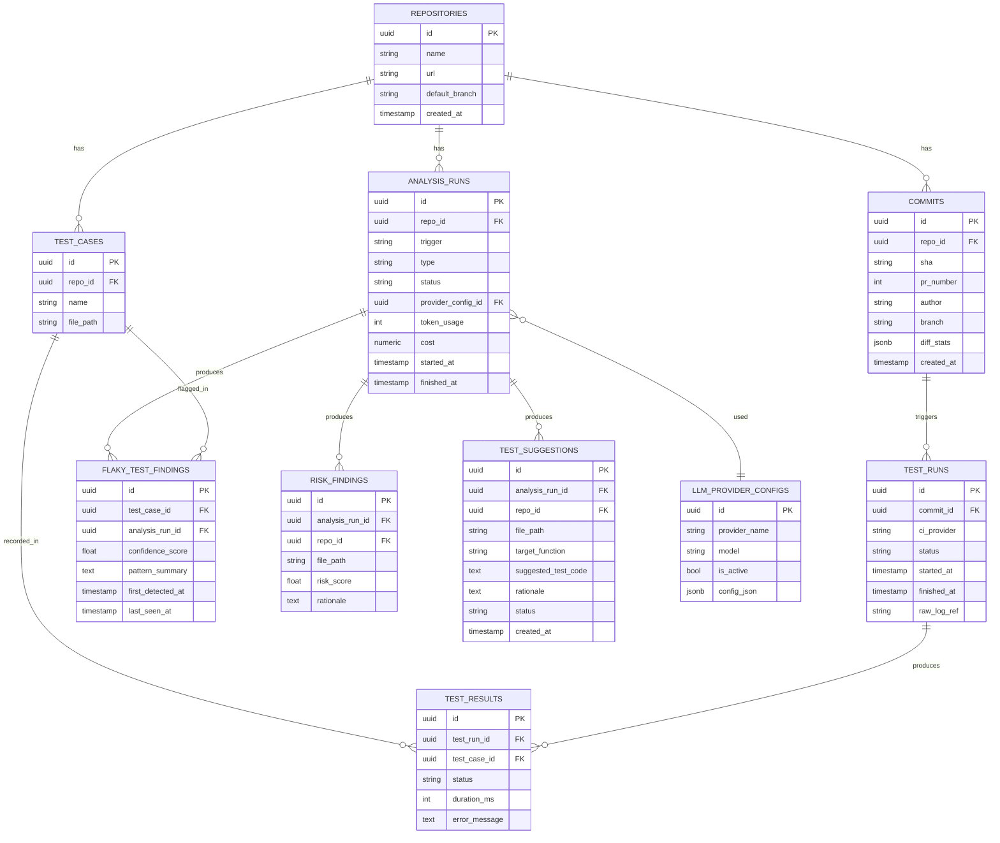

# System Design

Companion to [architecture.md](architecture.md). This document covers data flow,
database schema, and API boundaries in detail.

## 1. Data Flow: PR-Triggered Analysis

## 2. Data Flow: CI Failure Triage

## 3. Database Schema (High-Level)

**Notes:**

- `analysis_runs` is the anchor entity for observability and cost accounting — every
  engine invocation belongs to exactly one run, and every finding traces back to the run
  (and therefore the provider/model) that produced it.
- `test_suggestions.status` (`pending` / `accepted` / `rejected`) makes suggestion
  review an explicit workflow state rather than an implicit one, so acceptance-rate
  becomes a measurable signal on generation quality.
- Schema is intentionally high-level here; exact column types, indexes, and constraints
  are defined when persistence code is implemented, not in this design doc.

## 4. API Boundaries

All endpoints are versioned under `/api/v1`.

| Method | Path | Purpose |
|---|---|---|
| `POST` | `/repositories` | Register a repository with the platform |
| `GET` | `/repositories/{id}` | Repository detail |
| `POST` | `/repositories/{id}/analysis-runs` | Manually trigger an analysis run |
| `GET` | `/repositories/{id}/analysis-runs/{run_id}` | Analysis run status/result |
| `GET` | `/repositories/{id}/risk-findings` | List risk findings |
| `GET` | `/repositories/{id}/test-suggestions` | List test suggestions |
| `POST` | `/test-suggestions/{id}/accept` | Mark a suggestion accepted |
| `POST` | `/test-suggestions/{id}/reject` | Mark a suggestion rejected |
| `GET` | `/repositories/{id}/flaky-tests` | List flaky test findings |
| `POST` | `/webhooks/github` | GitHub PR/commit event ingestion |
| `POST` | `/webhooks/ci` | CI test-run result ingestion |

**Boundary rules:**

- The API layer only talks to `persistence/` (reads) and `orchestration/` (to enqueue
  work on `POST` endpoints that trigger analysis). It never imports an analysis engine
  or a provider implementation directly.
- Webhook endpoints are the only unauthenticated-by-default surface (secured instead by
  provider signature verification — e.g. GitHub's HMAC signature) since they're called
  by external systems, not end users; every other endpoint sits behind whatever
  authentication model is adopted (deferred — see roadmap).
- All analysis-triggering endpoints return immediately with an `analysis_run_id` in
  `pending` state; clients poll (or later, subscribe) for completion. No endpoint blocks
  on an LLM call.
- Response schemas are Pydantic models shared between the endpoint definition and the
  OpenAPI spec FastAPI generates automatically — the frontend's typed API client is
  intended to be generated from that spec rather than hand-synced.

## 5. Module Contracts

- **`AnalysisEngine` interface** (implemented by Risk, Generation, Triage engines):
  `run(context: AnalysisContext) -> AnalysisResult`. `AnalysisContext` carries the repo,
  commit/PR reference, and any engine-specific inputs (e.g. failed test results for
  triage). The orchestrator depends only on this interface, never on a concrete engine.
- **`LLMProvider` interface**: see [architecture.md §7](architecture.md#7-provider-abstraction-strategy).
- **`TaskQueue` interface**: `enqueue(job) -> job_id`, `status(job_id) -> JobStatus`.
  The in-process implementation runs jobs on an async worker pool within the API
  process; the interface is the seam a future Celery/Temporal-backed implementation
  would slot behind without changing any caller.
- **Repository pattern**: each persistence entity is accessed through a repository
  class (e.g. `RiskFindingRepository`), never through raw SQLAlchemy sessions from
  outside `persistence/` — this is what lets engines and API routes stay agnostic to
  schema details.
