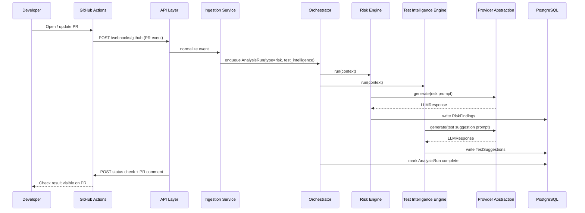
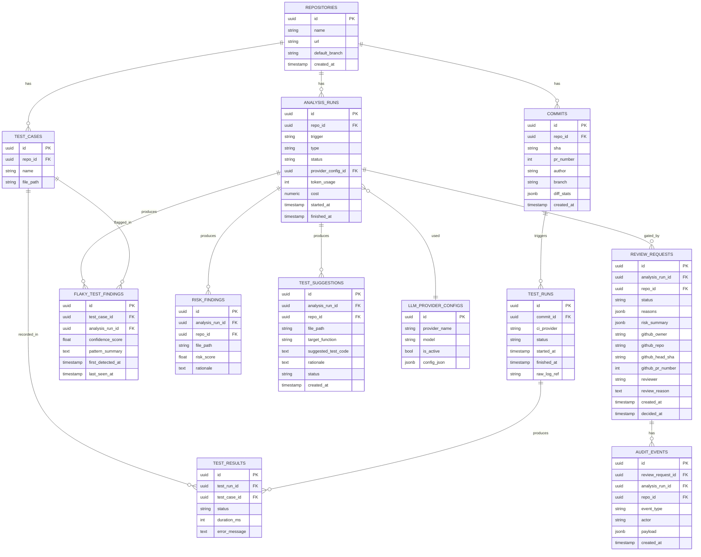

# System design

Detailed request and data contracts for the implemented platform. See [Architecture](architecture.md) for component ownership.

## Pull-request analysis

```mermaid
sequenceDiagram
    participant Dev as Developer
    participant GH as GitHub Actions
    participant API as API Layer
    participant Ing as Ingestion Service
    participant Orch as Orchestrator
    participant Risk as Risk Engine
    participant TestIntel as Test Intelligence Engine
    participant Prov as Provider Abstraction
    participant DB as PostgreSQL

    Dev->>GH: Open / update PR
    GH->>API: POST /webhooks/github (PR event)
    API->>Ing: normalize event
    Ing->>Orch: enqueue AnalysisRun(type=risk, test_intelligence)
    Orch->>Risk: run(context)
    Orch->>TestIntel: run(context)
    Risk->>Prov: generate(risk prompt)
    Prov-->>Risk: LLMResponse
    Risk->>DB: write RiskFindings
    TestIntel->>Prov: generate(test suggestion prompt)
    Prov-->>TestIntel: LLMResponse
    TestIntel->>DB: write TestSuggestions
    Orch->>DB: mark AnalysisRun complete
    API->>GH: POST status check + PR comment
    GH-->>Dev: Check result visible on PR
```

The webhook handler verifies GitHub's signature and retrieves the diff. Analysis runs asynchronously; results may complete in either order. Policy can hold publication pending human review rather than publishing an automatic success status.

## CI failure analysis

The failure-intelligence engine analyzes supplied logs and test results. Automatic ingestion of independent CI test-run webhooks is **not implemented**; the original design sequence should not be read as a working integration.

## Data model

```mermaid
erDiagram
    REPOSITORIES ||--o{ COMMITS : has
    REPOSITORIES ||--o{ ANALYSIS_RUNS : has
    REPOSITORIES ||--o{ TEST_CASES : has
    COMMITS ||--o{ TEST_RUNS : triggers
    TEST_RUNS ||--o{ TEST_RESULTS : produces
    TEST_CASES ||--o{ TEST_RESULTS : recorded_in
    TEST_CASES ||--o{ FLAKY_TEST_FINDINGS : flagged_in
    ANALYSIS_RUNS ||--o{ RISK_FINDINGS : produces
    ANALYSIS_RUNS ||--o{ TEST_SUGGESTIONS : produces
    ANALYSIS_RUNS ||--o{ FLAKY_TEST_FINDINGS : produces
    ANALYSIS_RUNS }o--|| LLM_PROVIDER_CONFIGS : used
    ANALYSIS_RUNS ||--o{ REVIEW_REQUESTS : gated_by
    REVIEW_REQUESTS ||--o{ AUDIT_EVENTS : has

    REPOSITORIES {
        uuid id PK
        string name
        string url
        string default_branch
        timestamp created_at
    }
    COMMITS {
        uuid id PK
        uuid repo_id FK
        string sha
        int pr_number
        string author
        string branch
        jsonb diff_stats
        timestamp created_at
    }
    TEST_RUNS {
        uuid id PK
        uuid commit_id FK
        string ci_provider
        string status
        timestamp started_at
        timestamp finished_at
        string raw_log_ref
    }
    TEST_CASES {
        uuid id PK
        uuid repo_id FK
        string name
        string file_path
    }
    TEST_RESULTS {
        uuid id PK
        uuid test_run_id FK
        uuid test_case_id FK
        string status
        int duration_ms
        text error_message
    }
    FLAKY_TEST_FINDINGS {
        uuid id PK
        uuid test_case_id FK
        uuid analysis_run_id FK
        float confidence_score
        text pattern_summary
        timestamp first_detected_at
        timestamp last_seen_at
    }
    RISK_FINDINGS {
        uuid id PK
        uuid analysis_run_id FK
        uuid repo_id FK
        string file_path
        float risk_score
        text rationale
    }
    TEST_SUGGESTIONS {
        uuid id PK
        uuid analysis_run_id FK
        uuid repo_id FK
        string file_path
        string target_function
        text suggested_test_code
        text rationale
        string status
        timestamp created_at
    }
    ANALYSIS_RUNS {
        uuid id PK
        uuid repo_id FK
        string trigger
        string type
        string status
        uuid provider_config_id FK
        int token_usage
        numeric cost
        timestamp started_at
        timestamp finished_at
    }
    LLM_PROVIDER_CONFIGS {
        uuid id PK
        string provider_name
        string model
        bool is_active
        jsonb config_json
    }
    REVIEW_REQUESTS {
        uuid id PK
        uuid analysis_run_id FK
        uuid repo_id FK
        string status
        jsonb reasons
        jsonb risk_summary
        string github_owner
        string github_repo
        string github_head_sha
        int github_pr_number
        string reviewer
        text review_reason
        timestamp created_at
        timestamp decided_at
    }
    AUDIT_EVENTS {
        uuid id PK
        uuid review_request_id FK
        uuid analysis_run_id FK
        uuid repo_id FK
        string event_type
        string actor
        jsonb payload
        timestamp created_at
    }
```

`analysis_runs` ties findings to provider/model execution. Review requests hold the current decision state; audit events retain the decision history. This diagram is a conceptual view; refer to migrations and models for the authoritative schema.

## API boundaries

All endpoints are versioned under `/api/v1`.

| Method | Path | Purpose |
|---|---|---|
| `POST` | `/repositories` | Register a repository with the platform |
| `GET` | `/repositories/{id}` | Repository detail |
| `POST` | `/repositories/{id}/analysis-runs` | Manually trigger an analysis run |
| `GET` | `/repositories/{id}/analysis-runs/{run_id}` | Analysis run status/result |
| `GET` | `/repositories/{id}/risk-findings` | List risk findings |
| `GET` | `/repositories/{id}/test-suggestions` | List test suggestions |
| `POST` | `/test-suggestions/{id}/accept` | Mark a suggestion accepted |
| `POST` | `/test-suggestions/{id}/reject` | Mark a suggestion rejected |
| `GET` | `/repositories/{id}/flaky-tests` | List flaky test findings |
| `POST` | `/webhooks/ci` | CI test-run result ingestion — not yet implemented |
| `GET` | `/review-queue/{id}` | Review request detail (incl. redacted risk_summary) |
| `GET` | `/review-queue/{id}/audit-events` | Immutable audit trail for one review request |
| `POST` | `/review-queue/{id}/approve` | Record an approval (reviewer, optional reason) |
| `POST` | `/review-queue/{id}/reject` | Record a rejection (reviewer, optional reason) |

**Boundary rules:**

- The API layer only talks to `persistence/` (reads) and `orchestration/` (to enqueue
  work on `POST` endpoints that trigger analysis). It never imports an analysis engine
  or a provider implementation directly.
- Webhook endpoints are the only unauthenticated-by-default surface (secured instead by
  provider signature verification — GitHub's HMAC-SHA256 `X-Hub-Signature-256`, verified
  they're called by external systems, not end users; every other endpoint sits behind
  whatever authentication model is adopted (deferred — see architecture.md §11).
- All analysis-triggering endpoints return immediately with an `analysis_run_id` in
  `pending` state; clients poll (or later, subscribe) for completion. No endpoint blocks
  on an LLM call.
- Response schemas are Pydantic models shared between the endpoint definition and the
  OpenAPI spec FastAPI generates automatically — the frontend's typed API client is
  intended to be generated from that spec rather than hand-synced.

## Module contracts

- **`AnalysisEngine` interface** (implemented by Risk, Test Intelligence, Failure
  Intelligence engines): `run(context: AnalysisContext) -> AnalysisResult`.
  `AnalysisContext` carries the repo, commit/PR reference, and any engine-specific
  inputs (e.g. failed test results for failure intelligence). The orchestrator depends
  only on this interface, never on a concrete engine.
- **`LLMProvider` interface**: see [architecture.md §7](architecture.md#7-provider-abstraction-strategy).
- **`TaskQueue` interface**: `enqueue(job) -> job_id`, `status(job_id) -> JobStatus`.
  The in-process implementation runs jobs on an async worker pool within the API
  process; the interface is the seam a future Celery/Temporal-backed implementation
  would slot behind without changing any caller.
- **Repository pattern**: each persistence entity is accessed through a repository
  class (e.g. `RiskFindingRepository`), never through raw SQLAlchemy sessions from
  outside `persistence/` — this is what lets engines and API routes stay agnostic to
  schema details.
- **`AnalysisOrchestrator.submit()`'s `on_result` parameter (Sprint 12)**: an optional
  `(analysis_run_id: UUID, result: AnalysisResult) -> None` callback, invoked exactly
  once when a run reaches a terminal state, always with a real `AnalysisResult` (one is
  synthesized for the "crashed/timed out with no result" path so callers never handle
  `None`). Generic — the orchestrator has no idea what a caller does with it. Used by
  `integrations/github/publisher.py`'s `PRAnalysisPublisher` to publish a commit status
  + PR comment once a webhook-triggered run finishes, but nothing about the parameter
  itself is GitHub-specific; any future trigger source needing a completion callback
  uses the same mechanism.
- **`GitHubClient` interface** (Sprint 12): `get_pull_request_diff(owner, repo, pr_number)
  -> str`, `post_commit_status(owner, repo, sha, *, state, description, context,
  target_url=None) -> None`, `post_issue_comment(owner, repo, issue_number, body) ->
  None`. Mirrors `LLMProvider`'s shape — an ABC callers depend on by interface,
  `RestGitHubClient` (real, via `httpx`) and `NullGitHubClient` (no `GITHUB_API_TOKEN`
  configured) as concrete implementations. See
  [architecture.md §5](architecture.md#5-backend-module-organization)'s Sprint 12 status
  note for the full webhook flow this powers.
- **`evaluate_risk_policy(risk_output) -> list[PolicyReason]`** (Sprint 13,
  `governance/policy.py`): a pure function, no I/O — takes the same `AnalysisResult
  .output` dict every other consumer of a risk result reads, returns every triggered
  rule (empty list means auto-approve). `requires_review(risk_output) -> bool` is the
  single-boolean convenience wrapper both call sites (`integrations/github/publisher.py`,
  `api/risk.py`) actually branch on.
- **`evaluate_and_maybe_create_review_request(session, ...) -> ReviewRequest | None`**
  and **`decide_review(session, ...) -> ReviewRequest`** (Sprint 13,
  `governance/review_service.py`): the only two entry points that write `ReviewRequest`/
  `AuditEvent` rows — every caller (webhook publisher, manual-trigger API, review-queue
  API) goes through these rather than constructing rows itself, so the redaction pass
  and the "always write a `policy_evaluated` audit event" invariant can't be
  accidentally skipped by a new call site. See
  [architecture.md §12](architecture.md#12-governance-and-human-review) for the full
  design.
